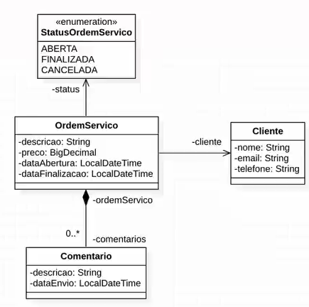

# API para gerenciamento de Clientes e Ordens de Serviço.
  
  
O seguinte repositório visa demonstrar o funcionamento de uma API criada com Java/Spring Boot.
A API permite ao usuário cadastrar clientes e ordens de serviço, além de comentários relacionados às ordens de serviço.

---
  
### Tecnologias Utilizadas:
* Linguagem de Programação: 
  - Java
* Framework:
  - Spring Boot (Spring Boot Web)
* Bibliotecas:
  - Flyway;
  - Spring Data JPA;
  - Jakarta Persistence;
  - Jakarta Bean Validation;
  - ModelMapper;
* Banco de Dados:
  - Postgres
* Deploy:
  - Heroku
---

### Classes (Entidades)
  
A API contém três entidades:
* Clientes;
* Ordens de Serviço;
* Comentários.
  
A enidade **cliente** possui como atributos um **Nome**, um **E-mail** e um **Telefone**.   
Já a **Ordem de serviço** possui uma **Descrição**, um **Preço**, um ***Status* (aberta, cancelada ou finalizada)**, uma **Data de abertura**, uma **Data de finalização**, além do **relacionamento obrigatório com um cliente**.  
Por fim, a entidade **Comentário** possui uma **Descrição**, uma **Data de criação**, além do **relacionamento obrigatório com uma ordem de serviço**.  

De forma resumida, os relacionamentos entre as entidades são apresentados na imagem a seguir:  
  

---

### EndPoints
Os *endpoints* para acesso aos recursos da API são:

| Entidade | URL                                                      | Método HTTP | Descrição                                    | Retorno |
|----------|----------------------------------------------------------|-------------|----------------------------------------------|---------|
| Cliente  | http://localhost:8080/clientes                           | GET         | Lista todos os clientes cadastrados          | List<Cliente> |
| Cliente  | http://localhost:8080/clientes/id_cliente                | GET         | Lista o cliente com o id informado           | Cliente |
| Cliente  | http://localhost:8080/clientes                           | POST        | Cria um novo cliente com os dados informados | Cliente |
| Cliente  | http://localhost:8080/clientes/id_cliente                | POST        | Atualiza os dados do cliente com os dados informados | Ciente |
| Cliente  | http://localhost:8080/clientes/id_cliente                | DELETE      | Deleta o cliente com o id informado          | Sem Retorno |
| Ordem de Servico  | http://localhost:8080/ordemservico              | GET         | Lista todas as ordens de serviço cadastradas | List<Ordem de Serviço> |
| Ordem de Serviço  | http://localhost:8080/ordemservico/id_ordemservico | GET         | Lista a ordem de serviço com o id informado| Ordem de Serviço |
| Ordem de Servico  | http://localhost:8080/ordemservico              | POST        | Cria uma ordens de serviço com as informações passadas | Ordem de Serviço |
| Ordem de Serviço  | http://localhost:8080/ordemservico/id_ordemservico | PUT      | Atualiza a ordem de serviço com o id informado | Ordem de Serviço |
| Ordem de Serviço  | http://localhost:8080/ordemservico/id_ordemservico | DELETE   | Deleta a ordem de serviço com o id informado | Sem Retorno |
| Ordem de Serviço  | http://localhost:8080/ordemservico/id_ordemservico/cancelar | GET         | Altera o *status* da ordem de serviço com o id informado para CANCELADO| Sem Retorno |
| Ordem de Serviço  | http://localhost:8080/ordemservico/id_ordemservico/finalizar | GET        | Altera o *status* da ordem de serviço com o id informado para FINALIZADO| Sem Retorno |
| Comentário  | http://localhost:8080/ordemservico/id_ordemservico/comentario      | GET         | Lista os comentários da ordem de serviço com o id informado| Comentário |

---

### Utilizando os recursos da API que utilizem o método GET diretamente no *browser*

Para acessar um recurso específico da API que utilize o método GET, digite na na barra de endereços do seu navegador o endereço específico do recurso da API que se deseja acessar, substituindo o ```http://localhost:8080``` pelo endereço da API disponível na plataforma *HEROKU* (```https://api-client-serviceorder.herokuapp.com/```).  
Por exemplo, para listar os clientes, acesse ```https://api-client-serviceorder.herokuapp.com/clientes```, e a lista de clientes disponíveis no banco da aplicação ficará disponível em tela, no formato **JSON**.

---

### Testando em uma máquina local

Para utilização na máquina local, sugiro a utilização do *Postman* ou do *Insomnia* para simular um *client-side*. Depois de instalado, baixe este repositório na sua máquina e rode o projeto Spring Boot. Depois de rodar o projeto, o mesmo estará simulando um *server-side* na sua máquina no endereço *http://localhost:8080*.
Abra o *postman* ou o *insomnia* e configure as rotas de utilização conforme o indicado na seção *Endpoints* desta página.

### Retornos 
Por padrão, neste projeto, o retorno obtido é um objeto JSON, contendo os dados advindos da base de dados.  
A escolha se deu pela ampla adesão ao padrão JSON pelo mercado, pela leveza e facilidade no recebimento e envio de dados. 
Dessa forma, espera-se maior performance, considerando que o heroku costuma 
demorar um pouco para responder as primeiras requisição, uma vez que os serviços envolvidos rodam num servidor localizado nos EUA, e, além disso,
 a propria plataforma tem suas regras de segurança que consomem mais tempo para validar as requisições e suas respostas.
